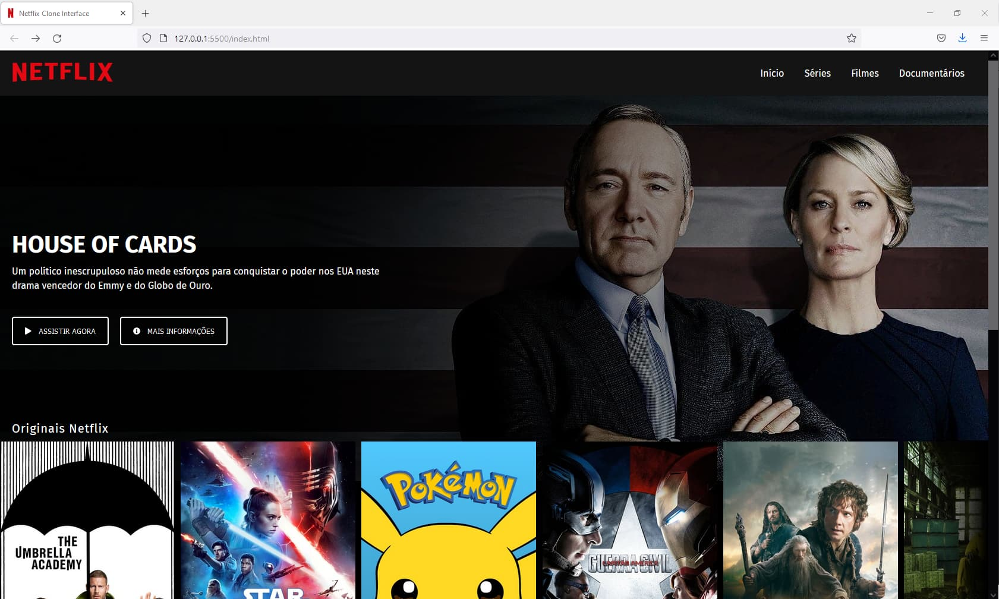
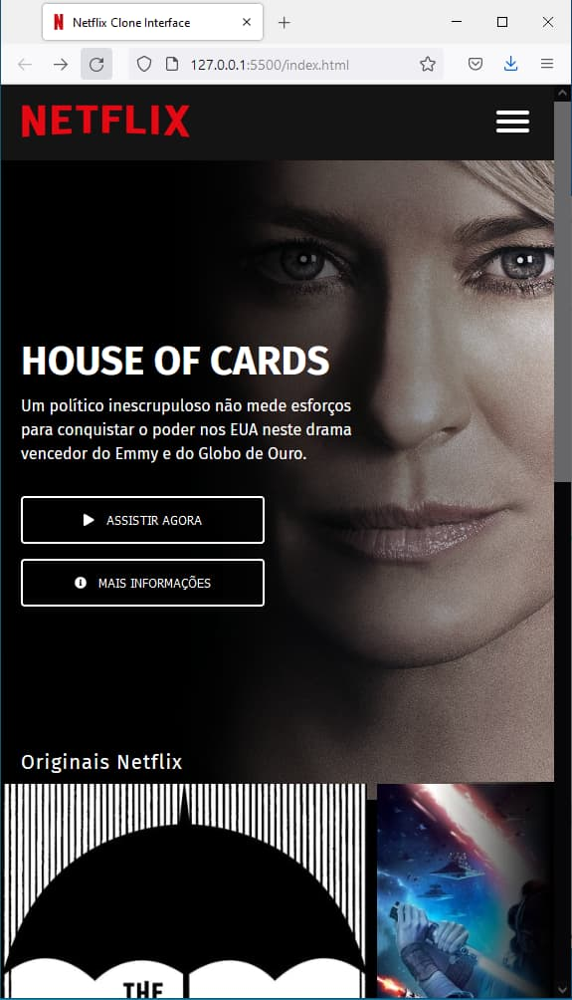

# Clone Netflix interface
## DIO Repositório para estudos - Bootcamp - Frontend Developer

Este respositório é destinado para publicação de estudos, desafios e tarefas do Bootcamp Inter Frontend Developer

## Desafio, recriando a Interface do Netflix

Recriando a interface do principal site de streaming mundial utilizando tecnologias simples como HTML5, SASS / CSS3 e JavaScript. Com as seguintes funcionalidades: vídeo de background no topo da home, menu hamburguer na versão mobile, carroucel de imagens com Owl Caroucel e media queries.

### Link de preview
<https://henderson-dev.github.io/DIO_Netflix-clone-interface_HTML/>

### Print desktop version

### Print Mobile version

